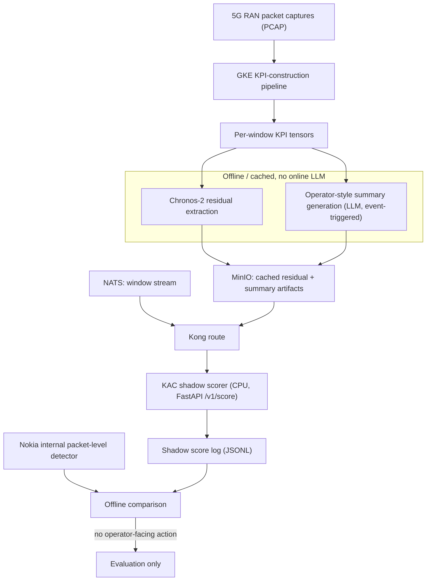

# KAC pre-production shadow architecture

This is the deployment described in the paper (Sections "Pre-Production Shadow
Integration and Operational Cost" and "Shadow Integration Status"). KAC runs in
**shadow mode** next to Nokia's internal packet-level anomaly detector: it scores
cached telemetry windows and logs the scores for **offline comparison**. It does
**not** promote incidents, raise operator-facing alerts, or trigger mitigation.

## Data flow

## What maps to what in this repo

| Paper / Nokia component | Portable artifact in this repo |
|---|---|
| GKE KPI-construction pipeline | out of scope (Nokia-internal); produces the cached tensors |
| Chronos-2 residual extraction (offline) | `scripts/compute_chronos_residuals.py` |
| Operator-style summaries (offline, event-triggered) | `experiments/SpotLight/generate_spotlight_descriptions.py` and templates |
| MinIO cached-artifact store | `deployment/docker-compose.yml` (`minio` service) |
| NATS window stream + Kong route | documented here; `k8s/service.yaml` is the route target |
| CPU shadow scorer | `deployment/serve_app.py` (+ `kac_service.py`) |
| Shadow score logging for offline comparison | `deployment/shadow_runner.py` -> `logs/shadow_scores.jsonl` |
| Operational-cost table (params + CPU latency) | `deployment/benchmark_latency.py` -> `tables/deployment_*.tex` |

## Why CPU-only and no online LLM

The online path consumes **cached** residuals and summaries, so the scorer is a
DistilBERT encoder plus lightweight fusion/heads (~0.21% of params beyond the
backbone). Batch-1 scoring is well under the 100 ms telemetry cadence, so no GPU
is allocated for the shadow scorer. See `benchmark_latency.py`.
